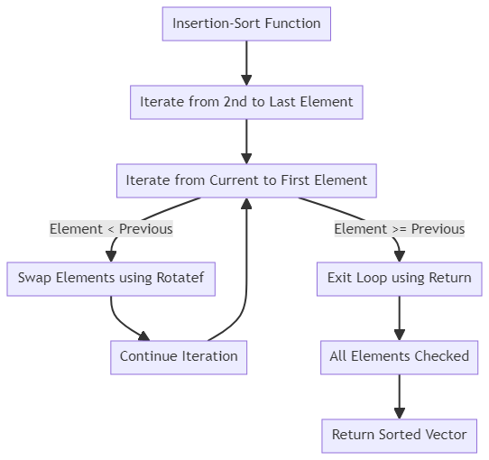
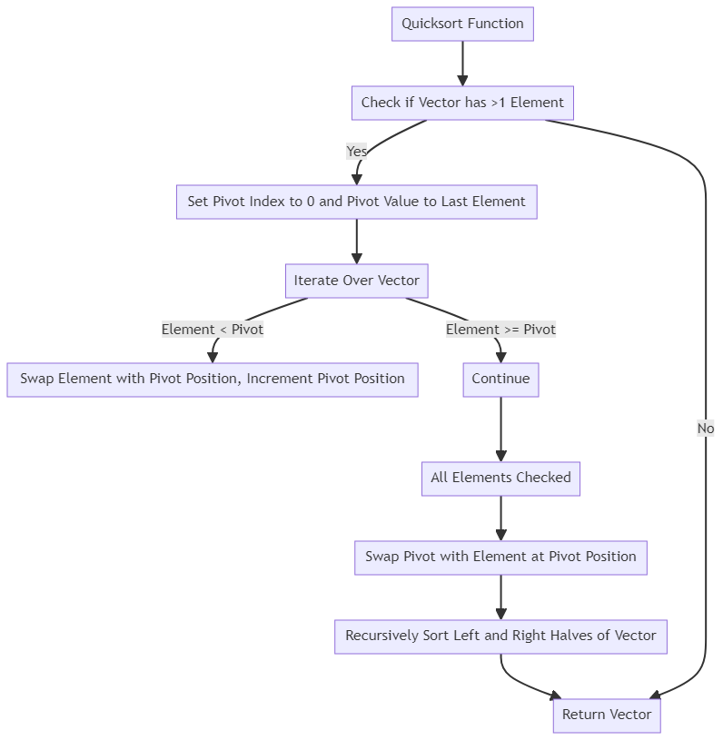

# **What is Insertion Sort?**
- Insertion Sort is a simple sorting algorithm.
- It works by dividing the list into two parts: a sorted part and an unsorted part.
- It starts with a single element in the sorted part (the leftmost element) and gradually builds up the sorted part one element at a time.

**Online Sorting:**
- Insertion Sort is an "online" sorting algorithm.
- This means that it doesn't require looking at the entire list to sort it.
- Unlike some other sorting algorithms like Selection Sort, which need to find the maximum element of the whole list, Insertion Sort can sort the list while it's being read.

**How Does Insertion Sort Work?**

- Summarized Explanation: 
  - Imagine you have a deck of cards, and you want to sort them in your hand.
  - You start with the first card (already considered sorted because it's the only one).
  - Then, you pick the next card from the unsorted part and insert it into the correct position among the already sorted cards.
  - You repeat this process until all cards are sorted.

- Detailed Explanation: 
  1. **Initial Setup**: Imagine you have a deck of playing cards, and they are all shuffled, so they are in no particular order. You're holding this deck in your hand.

  2. **Starting with the First Card**: To begin sorting, you start with the first card in your hand. At this point, you consider it as already sorted because, in a one-card "sorted" list, there's nothing to compare it to.

  3. **Picking the Next Card**: You then pick the next card from the unsorted part of your hand. This card represents the first card in the unsorted portion of the list.

  4. **Insertion**: Now comes the crucial part. You need to insert this card into the correct position among the already sorted cards in your hand. You do this by comparing it to the cards in the sorted part of your hand, starting from the rightmost card in the sorted part and moving left.

      - If the card you're holding is smaller (or equal, depending on the sorting order) than the card you're comparing it to, you shift the compared card one position to the right to make space for the new card. You keep doing this until you find the correct position for the card you're holding.

      - If the card you're holding is larger than the compared card or you've reached the leftmost card in the sorted part, you stop shifting cards and insert the card you're holding into the position you've found.

   5. **Repeat for All Cards**: You continue this process for the remaining unsorted cards one by one. Each time you pick a card, you insert it into the correct position among the already sorted cards. This process repeats until all cards in the deck are sorted.


**Insertion Sort in Code:**
```lisp
(defun insertion-sort (vec comp)
    "Sort vector vec using the comparison function comp."

    ;; Iterate over the vector from the second element to the last element
    (dotimes (i (1- (length vec)))

        ;; Iterate over the vector from the current element to the first element
        (do ((j i (1- j)))

            ;; Check if j is negative
            ((minusp j))

            ;; If the current element is less than the previous element, swap them
            (if (funcall comp (aref vec (1+ j)) (aref vec j))
                (rotatef (aref vec (1+ j)) (aref vec j))

                ;; If the current element is greater than or equal to the previous element, exit the loop
                (return))))

    ;; Return the sorted vector
    vec)
```
**Code Explanation:** insertion-sort function takes a vector vec and a comparison function comp as arguments, and sorts the vector using the comparison function. The function first iterates over the vector from the second element to the last element using the dotimes function. It then iterates over the vector from the current element to the first element using the do function. If the current element is less than the previous element, it swaps them using the rotatef function. If the current element is greater than or equal to the previous element, it exits the loop using the return function. Finally, the function returns the sorted vector.

**Diagram:**



**Key Terms in Insertion Sort:**
- **i**: It's an index representing the leftmost unsorted element, starting from 0 and incrementing by one.
- **j**: Initially, it's set to `i`, and it's the index of the current element being inserted into the sorted part.
- When comparing the current element and its left neighbor (of index `j`), if the comparison is true, they are swapped, `j` is decremented by one, and the process continues.
- If no insertion (swap) takes place, `j` is incremented.

**Example:**
```lisp
(insertion-sort #(6 9 5 1 3 5 4 0 7 4) #'<)
```
This code will sort the list `(6 9 5 1 3 5 4 0 7 4)` in ascending order using the `<` (less than) comparison function. The result will be `(0 1 3 4 4 5 5 6 7 9)`.

**Analysis of Insertion Sort:**
- The number of comparisons in Insertion Sort depends on the number of elements to be sorted.
- It can be calculated as the sum of an arithmetic progression from 1 to `n`, where `n` is the number of elements in the list.
- The number of comparisons is proportional to `n^2`, which means it can become inefficient for large lists.


# **What is Quicksort?**
- Quicksort is a well-known sorting algorithm.
- It's a part of the class of sorting algorithms that are very efficient and work relatively fast.

**Divide-and-Conquer Approach:**
- Quicksort uses a divide-and-conquer approach, which means it divides the list into smaller parts and sorts those parts individually before combining them.
- This is similar to breaking a big problem into smaller, more manageable problems.

**How Quicksort Works:**
- Quicksort works by choosing a pivot value from the list (there are different strategies for choosing the pivot).
- It then rearranges the list so that all elements smaller than the pivot are on one side, and all elements greater than the pivot are on the other side.
- The pivot is now in its correct sorted position.
- This process is repeated for the two sublists on either side of the pivot, and the recursion continues until the entire list is sorted.

**Quicksort in Code:**
```lisp
(defun quicksort (vec comp)
    "Sort vector vec using the comparison function comp."

    ;; Check if the vector has more than one element
    (when (> (length vec) 1)

        ;; Set the pivot index to 0 and the pivot value to the last element in the vector
        (let ((ppvt 0)
                    (pivot (aref vec (1- (length vec))))) ; last element

            ;; Iterate over the vector and find the position of the pivot
            (dotimes (i (1- (length vec)))

                ;; If the current element is less than the pivot, swap it with the element at the pivot position and increment the pivot position
                (when (funcall comp (aref vec i) pivot)
                    (rotatef (aref vec i) (aref vec ppvt))
                    (incf ppvt)))

            ;; Swap the pivot (last element) to its proper place
            (rotatef (aref vec (1- (length vec))) (aref vec ppvt))

            ;; Recursively sort the left and right halves of the vector
            (quicksort (rtl:slice vec 0 ppvt) comp)
            (quicksort (rtl:slice vec (1+ ppvt)) comp)))

    ;; Return the sorted vector
    vec)
```
**Code Explanation:** Quicksort function takes a vector vec and a comparison function comp as arguments, and sorts the vector using the comparison function. The function first checks if the vector has more than one element. If yes, it sets the pivot index to 0 and the pivot value to the last element in the vector. It then iterates over the vector and finds the position of the pivot. If the current element is less than the pivot, it swaps it with the element at the pivot position and increments the pivot position. Once the pivot position is found, the function swaps the pivot (last element) to its proper place and recursively sorts the left and right halves of the vector. Finally, the function returns the sorted vector.

**Diagram:**


**Mathematical Concepts:**
- Quicksort's time complexity is typically expressed using Big O notation. In the best-case scenario, it's O(n*log(n)), which means it's very efficient. However, in the worst-case scenario, it can be O(n^2), which is less efficient.

**Best Case:**
- The best case occurs when the pivot chosen is roughly in the middle of the list.
- In this case, Quicksort performs roughly n*log(n) operations, which is quite efficient.

**Worst Case:**
- The worst case occurs when the pivot is consistently chosen poorly (e.g., always the smallest or largest element).
- In this case, Quicksort may perform as many as n^2 operations, which can be less efficient.

**In-Place Sorting:**
- Quicksort is often implemented as an in-place sorting algorithm. This means it doesn't create additional copies of the list; it sorts the list in its original place.

**Conversion to Looping:**
- Quicksort's recursive nature can be challenging to convert into a looping structure, making it suitable for functional programming languages.

**Example:**
Suppose we have a list of courses that we want to sort based on their course codes:

```lisp
(quicksort a #'(lambda (x y)
 (string< (course-code x) (course-code y))))
```

In this example, `a` is an array of courses, and we're sorting them based on their course codes in ascending order.

**Given Vector:**
```lisp
#( 20 26 93 17 77 31 44 55 54 )
```

This is a vector of numbers that we want to sort using Quicksort.

