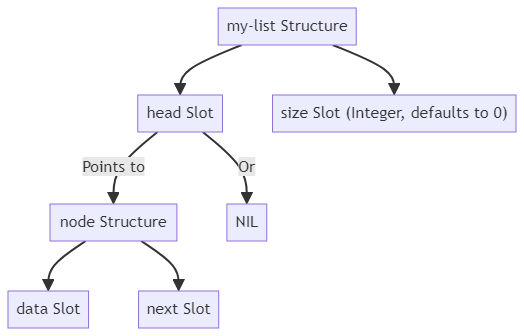
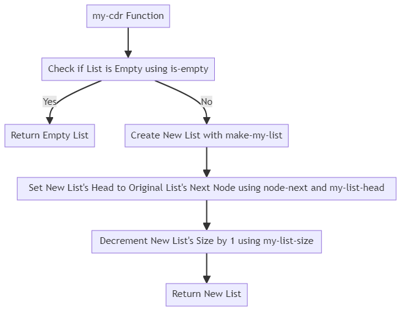
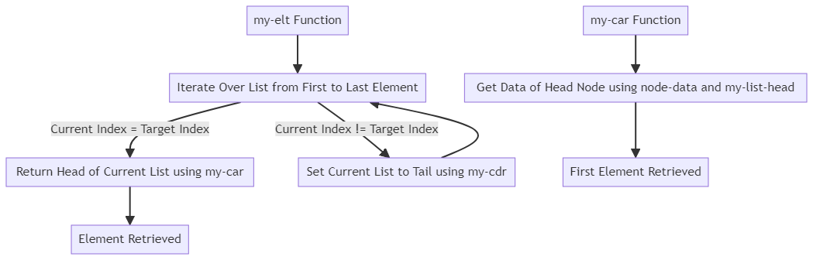
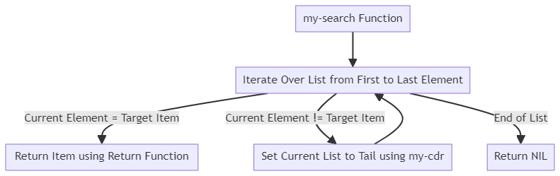

# **Programmer-Defined Linked Lists**
- In programming, we often work with lists of data.
- While some programming languages provide built-in list data types, there are situations where you might want to create your own list data type, tailored to your specific needs.

**Structure of Programmer-Defined Lists:**
- Programmer-defined lists are typically implemented as linked lists.
- A linked list consists of nodes, where each node contains data and a reference (or pointer) to the next node in the list.
- This forms a chain of nodes, with each node pointing to the next one.
- To represent the list itself, you can use a tuple or a structure with two slots:
  - `head`: a pointer to the first node in the list.
  - `size`: the length of the list (keeping track of size can increase storage requirements and complicate list updates).

**Defining Linked Lists in Lisp:**
- In Lisp, you can define linked lists using structures.
- Here's an example of defining node and list structures in Lisp:
```lisp
;; Define a structure type named "node" with two slots: "data" and "next"
(defstruct node
    data
    next)

;; Define a structure type named "my-list" with two slots: "head" and "size"
(defstruct my-list
    (head nil :type (or node null))  ; the head of the list, which is either a "node" structure or NIL
    (size 0 :type (integer 0)))  ; the size of the list, which is an integer and defaults to 0
```
  - `node` has two slots: `data` (for storing data) and `next` (for pointing to the next node).
  - `my-list` has `head` (points to the first node or is `nil` for an empty list) and `size` (the length of the list).
  -  code defines two structure types: "node" and "my-list". The "node" structure type has two slots: "data" and "next". The "my-list" structure type has two slots: "head" and "size". The "head" slot of the "my-list" structure type is either a "node" structure or NIL, and the "size" slot is an integer that defaults to 0.

**Diagram for Code:**



**Example: Implementing `my-cdr` (Equivalent of `CDR` in Lisp):**
- To define a function similar to `CDR` in Lisp for your custom list, you might do something like this:
```lisp
(defun my-cdr (alist)
    "Return the tail of the list alist."

    ;; Check if the list is empty
    (if (is-empty alist)

            ;; If yes, return the empty list
            alist

            ;; If no, create a new list with the head of the original list's next node and size decremented by 1
            (make-my-list :head (node-next (my-list-head alist))  ; the head of the new list is the next node of the original list's head
                                        :size (1- (my-list-size alist)))))  ; the size of the new list is 1 less than the original list's size
```
  - This function returns the rest of the list (everything except the first element) or an empty list if it's already empty.
  - The `my-cdr` function takes a list alist as an argument and returns the tail of the list. The function first checks if the list is empty using the is-empty function. If yes, it returns the empty list. If no, it creates a new list using the make-my-list function with the head of the original list's next node as the new list's head and the size of the new list decremented by 1. The node-next function is used to get the next node of the original list's head, and the my-list-head and my-list-size functions are used to get the head and size of the original list, respectively.

**Diagram for Code:**


**Accessing Elements in the List:**
- To access elements in your custom list, you can define functions like `my-car` (similar to `CAR` in Lisp) and `my-elt`:
```lisp
(defun my-car (alist)
    "Return the head of the list alist."

    ;; Get the data of the head node of the list alist
    (node-data (my-list-head alist)))

(defun my-elt (list index)
    "Return the element at position 'index' in the list; otherwise return NIL."

    ;; Iterate over the list from the first element to the last element
    (dotimes (i (my-list-size list))

        ;; Check if the current index is equal to the target index
        (if (= i index)

                ;; If yes, return the head of the current list
                (return (my-car list))

                ;; If no, set the current list to the tail of the current list
                (setf list (my-cdr list)))))

```
  - `my-car` returns the first element of the list.
  - `my-elt` returns the element at a specified index in the list.
  - The `my-car` function takes a list alist as an argument and returns the head of the list. The function first gets the data of the head node of the list using the node-data function and the my-list-head function.
  -  `my-elt` function takes a list list and an index index as arguments and returns the element at the specified index in the list. The function first iterates over the list from the first element to the last element using the dotimes function. It then checks if the current index is equal to the target index using the = function. If yes, it returns the head of the current list using the my-car function. If no, it sets the current list to the tail of the current list using the my-cdr function.

**Diagram for Code:**



**Searching for an Item in the List:**
- You can also define a search function to look for a specific item in your custom list:
```lisp
(defun my-search (item alist)
    "Returns the item if it is in the linked list; otherwise returns NIL"

    ;; Iterate over the list from the first element to the last element
    (dotimes (i (my-list-size alist))

        ;; Check if the current element is equal to the target item
        (if (equalp item (my-car alist))

                ;; If yes, return the item
                (return item)

                ;; If no, set the current list to the tail of the current list
                (setf alist (my-cdr alist)))))
```
  - `my-search` returns the item if found in the list, or `NIL` otherwise.
  -  `my-search` function takes an item item and a linked list alist as arguments and returns the item if it is in the linked list; otherwise returns NIL. The function first iterates over the list from the first element to the last element using the dotimes function. It then checks if the current element is equal to the target item using the equalp function and the my-car function. If yes, it returns the item using the return function. If no, it sets the current list to the tail of the current list using the my-cdr function.

**Diagram for Code:**

