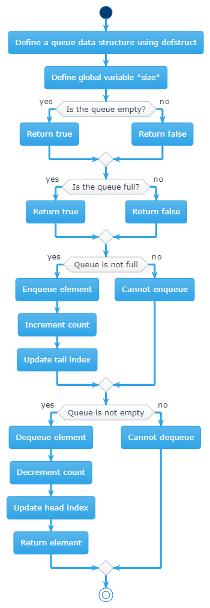
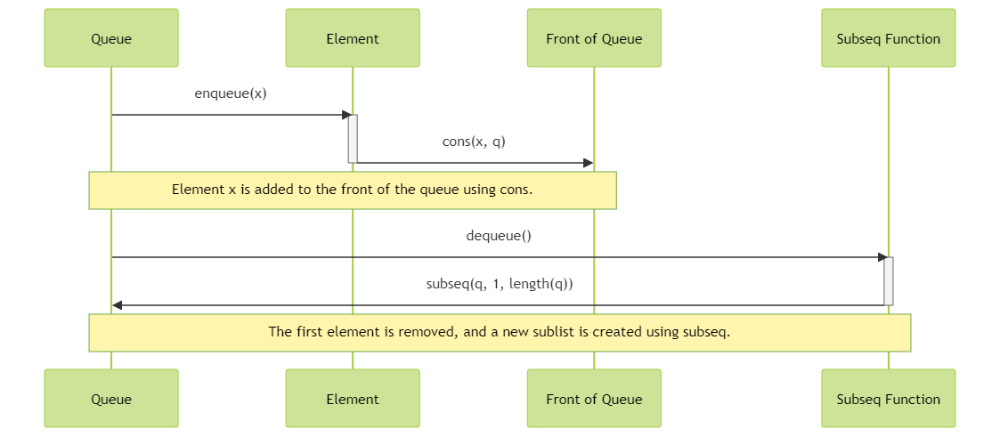
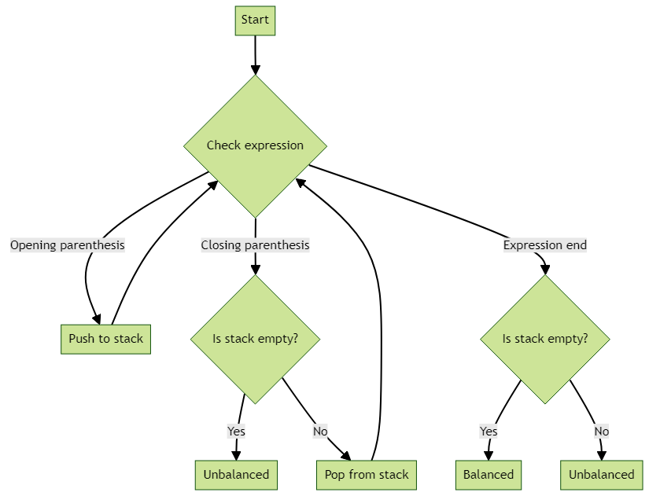
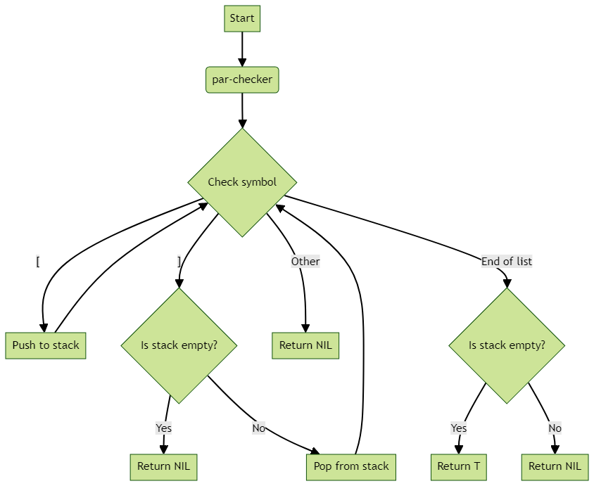

# What is a Queue?
A queue is like a line of people waiting for a bus. The first person who arrives is the first person to get on the bus. This is called First-In-First-Out (FIFO).

#### Example:
Imagine a line of 3 people:
- Person A arrived first,
- Person B arrived second,
- Person C arrived third.

In this order, Person A will be the first to board the bus, followed by Person B, and then Person C.

### 2. Queue in Computing
In the world of computing, a queue is used to store data elements in an ordered way, similar to the bus example. Data elements enter the queue at the end (enqueued) and leave from the front (dequeued).

#### Example:
Consider a printer queue:
- Document 1 is sent to the printer,
- Document 2 is sent while Document 1 is still printing,
- Document 2 waits in line.

Document 1 is printed first (dequeued), and then Document 2 is printed (dequeued).

### 3. Queue using an Array
In programming, an array can be used to implement a queue. The array holds the items in the queue. We use two pointers, ‘head’ and ‘tail’, to keep track of where the queue starts and ends.

#### Example with the provided initial array:
- Array: [4, 12, 17]
- Head points to 4, and Tail points to the space after 17.

### Operations:
**a. ENQUEUE 11** (add 11 to the queue)
- Array after operation: [4, 12, 17, 11]
- Head still points to 4, Tail moves to point after 11.

**b. ENQUEUE 7** (add 7 to the queue)
- Array after operation: [4, 12, 17, 11, 7]
- Head still points to 4, Tail moves to point after 7.

**c. DEQUEUE** (remove the first item from the queue)
- Array after operation: [12, 17, 11, 7]
- Head now points to 12, Tail still points after 7.

**d. DEQUEUE** (remove the next first item from the queue)
- Array after operation: [17, 11, 7]
- Head now points to 17, Tail still points after 7.

### 4. Queue Implementation in Code
The provided Lisp code defines a queue structure and functions to check if the queue is empty or full, to add an item to the queue (enqueue), and to remove an item from the queue (dequeue).

Certainly, I'll include the provided code within the document. Here's the document with the code snippet:

---

**Queues: Implementation**

```lisp
(defparameter *size* 4)

;; Define a queue data structure using defstruct
(defstruct queue
 (data (make-array *size*))  ; An array to store the data
 (head 0)  ; The index of the first element in the queue
 (tail 0)  ; The index of the next available slot in the queue
 (count 0))  ; The number of elements in the queue

(defun is-empty (q)
    "Return true if the queue q is empty; otherwise return false."

    ;; Check if the head and tail indices are equal and the count is 0
    (and (= (queue-head q) (queue-tail q))
             (= (queue-count q) 0)))

(defun is-full (q)
    "Return true if the queue q is full; otherwise return false."

    ;; Check if the head and tail indices are equal and the count is equal to the size of the queue
    (and (= (queue-head q) (queue-tail q))
             (= (queue-count q) *size*)))

(defun enqueue (q x)
    "Add the element x to the queue q."

    ;; Check if the queue is not full
    (unless (is-full q)

        ;; Increment the count of the queue
        (incf (queue-count q))

        ;; Set the next available slot in the queue to x
        (setf (aref (queue-data q) (queue-tail q)) x)

        ;; Update the tail index of the queue
        (if (= (queue-tail q) (1- *size*))
                (setf (queue-tail q) 0)
                (setf (queue-tail q) (1+ (queue-tail q))))))

(defun dequeue (q)
    "Remove and return the first element from the queue q."

    ;; Check if the queue is not empty
    (unless (is-empty q)

        ;; Decrement the count of the queue
        (decf (queue-count q))

        ;; Get the first element of the queue
        (let ((x (aref (queue-data q) (queue-head q))))

            ;; Update the head index of the queue
            (if (= (queue-head q) (1- *size*))
                    (setf (queue-head q) 0)
                    (setf (queue-head q) (1+ (queue-head q)))))

        ;; Return the first element of the queue
        x))
```
---
- code defines a queue data structure using defstruct and provides functions to check if the queue is empty or full, and to enqueue and dequeue elements from the queue. The defparameter form defines a global variable *size* that specifies the size of the queue.
- is-empty function checks if the head and tail indices are equal and the count is 0 to determine if the queue is empty. The is-full function checks if the head and tail indices are equal and the count is equal to the size of the queue to determine if the queue is full.
- enqueue function adds an element to the queue if the queue is not full. It increments the count of the queue, sets the next available slot in the queue to the element, and updates the tail index of the queue.
- dequeue function removes and returns the first element from the queue if the queue is not empty. It decrements the count of the queue, gets the first element of the queue, updates the head index of the queue, and returns the first element of the queue.

**Code Diagram:**


#### Breakdown:
**a. Creating a Queue** 
- The queue has an array to store data, a head, a tail, and a count of items.

**b. Checking if the Queue is Empty or Full** 
- It’s empty if the head and tail are at the same position, and the count is 0.
- It’s full if the head and tail are at the same position but the count equals the array's size.

**c. Adding an Item (ENQUEUE)**
- Check if the queue is not full.
- Increase the count.
- Add the item at the tail’s position.
- Move the tail to the next position.

**d. Removing an Item (DEQUEUE)**
- Check if the queue is not empty.
- Decrease the count.
- Remove the item at the head’s position.
- Move the head to the next position.


# Array-Based Implementation

#### ENQUEUE (Adding an Item)
- In array-based implementation, adding an item (ENQUEUE) to the end of the queue is straightforward.
- Imagine it like adding a book to a stack of books.

#### Example:
Suppose you have an array-based queue with the following items: [4, 12, 17].
- ENQUEUE 11: You add 11 to the end, and it becomes [4, 12, 17, 11].

#### DEQUEUE (Removing an Item)
- Removing an item (DEQUEUE) from the front of the queue requires shifting all other items to fill the gap.
- Think of it like removing the first book from a stack and moving all other books up.

#### Example:
Continuing from the previous example:
- DEQUEUE: You remove 4 from the front, and the queue becomes [12, 17, 11].

#### Dynamic Resizing
- If the array becomes full and you want to add more items (ENQUEUE), you might need to allocate a new, larger array and copy the existing items over.
- This can be similar to getting a bigger bookshelf when you run out of space.

### List-Based Implementation

#### ENQUEUE (Adding an Item)
- In list-based implementations, adding an item (ENQUEUE) is like adding a new item to the beginning of a linked list.
- It's efficient because you don't need to shift other items.

#### Example:
Suppose you have a list-based queue with items: (3 4 5).
- ENQUEUE 1: You add 1 to the front, and it becomes (1 3 4 5).

#### DEQUEUE (Removing an Item)
- Removing an item (DEQUEUE) from the front of a list-based queue is also efficient.
- You simply remove the first item.

#### Example:
Continuing from the previous example:
- DEQUEUE: You remove 1 from the front, and the queue becomes (3 4 5).

#### Garbage Collection
- Lists in Lisp automatically handle memory management and garbage collection when items are removed.
- Think of it as automatically cleaning up the space when you're done with a book.

### Example of List-Based Implementation in Lisp

Here's an example of ENQUEUE and DEQUEUE functions in Lisp for a list-based implementation:

```lisp
(defun enqueue (q x)
    "Add the element x to the queue q."

    ;; Add the element x to the front of the list q using the cons function
    (cons x q))

(defun dequeue (q)
    "Remove and return the first element from the queue q."

    ;; Get a sublist of q from the beginning to the second-to-last element using the subseq function
    (subseq q 0 (1- (length q))))
```

- **ENQUEUE**: The `enqueue` function adds an item to the front of the list using `cons`.
- **DEQUEUE**: The `dequeue` function removes the first item by creating a new list without it using `subseq`.
-  `enqueue` function takes a list q and an element x as arguments, and adds the element x to the queue q. The function adds the element x to the front of the list q using the cons function.
- `dequeue` function takes a list q as an argument, removes and returns the first element from the queue q. The function gets a sublist of q from the beginning to the second-to-last element using the subseq function. This effectively removes the first element from the queue.


#### Examples:

```lisp
CL-USER> (enqueue '(3 4 5) 1)
;; Add the element 1 to the front of the list (3 4 5) using the cons function
(1 3 4 5)

CL-USER> (dequeue '(1 3 4 5))
;; Get a sublist of (1 3 4 5) from the beginning to the second-to-last element using the subseq function
(1 3 4)
```

- When you ENQUEUE 1, it's added to the front.
- When you DEQUEUE, it removes the first item.
- `enqueue` function with the list (3 4 5) and the element 1. The function adds the element 1 to the front of the list (3 4 5) using the cons function, and returns the resulting list (1 3 4 5).
- `dequeue` function with the list (1 3 4 5). The function gets a sublist of (1 3 4 5) from the beginning to the second-to-last element using the subseq function, effectively removing the first element from the list, and returns the resulting list (1 3 4).

#### Complexity:
- ENQUEUE in the list-based implementation is O(1) because it's just adding an item to the front.
- DEQUEUE in the list-based implementation is O(n) because it involves creating a new list without the first item.
- The array-based implementation can have O(1) or O(n) complexity depending on dynamic resizing.

# Stack - The "Push-Down" Data Structure

- A stack is like a stack of plates or books. You can only add or remove items from the top of the stack.
- It follows the Last-In-First-Out (LIFO) principle, meaning the last item you put in (push) is the first one to come out (pop).

#### Examples:
1. **Stack of Plates:**
   - Imagine a stack of plates. You can only put a new plate on top or take the top plate off.
   - If you put plates in this order: Plate A, Plate B, Plate C, and you want to take one out, you'll get Plate C first, then Plate B, and finally Plate A.

2. **Mathematical Expression Evaluation:**
   - When you evaluate an expression like 1 + 3 * (2 - 1), you use a stack to keep track of the numbers and operators.
   - You follow the LIFO principle: The last operator you encountered (* in this case) gets evaluated first.

3. **Backward Navigation in Web Browsers:**
   - When you click the "Back" button in a web browser, it goes back to the last page you visited, which is like removing the last page from a stack of pages.

### Stack Data Structure and Interface

- A stack can be easily implemented using a list data structure.
- The key operations are:
   - PUSH: To add an item to the top of the stack.
   - POP: To remove and return the item from the top of the stack.
   - PEEK: To look at the item on the top of the stack without removing it.
   - IS-EMPTY: To check if the stack is empty.

#### Examples in Lisp:

```lisp
(defvar *stack* '()) ; Initialize an empty stack

(push 11 *stack*) ; PUSH 11 onto the stack
; *stack* is now '(11)

(push -31 *stack*) ; PUSH -31 onto the stack
; *stack* is now '(-31 11)

(pop *stack*) ; POP the top item from the stack, which is -31
; *stack* is now '(11)

(defun peek (s)
    "Return the top item of stack s without removing it."

    ;; Return the first element of s using the car function
    (car s))

(peek *stack*) ; PEEK the top item, which is 11
; Returns 11
```

### Example: Parenthesis Checker

- One practical application of a stack is to check if parentheses in an expression are balanced.
- The idea is to push an opening parenthesis onto the stack when encountered and pop it when a closing parenthesis is encountered. If the stack is empty when a closing parenthesis is encountered, the expression is unbalanced.
-  Code defines a stack data structure using a global variable *stack* and provides functions to push, pop, and peek at elements in the stack.
- defvar form initializes an empty stack *stack* using the empty list ().
-  push function adds an element to the top of the stack by using the push function to add the element to the front of the list *stack*.
- pop function removes and returns the top element from the stack by using the pop function to remove the first element from the list *stack*.
- peek function returns the top element of the stack without removing it by using the car function to return the first element of the list s.



#### Example in Lisp:

```lisp
(defun par-checker (list)
    "Returns T if the [s in list are matched with their ]s"

    ;; Initialize stack s to NIL using the let function
    (let ((s nil))

        ;; Iterate over the symbols in list using the dolist function
        (dolist (symbol list (null s))

            ;; Check the type of the symbol using the case function
            (case symbol

                ;; If the symbol is [, push it onto the stack s using the push function
                ([ (push symbol s))

                ;; If the symbol is ], check if the stack s is empty using the null function
                (] (if (null s)

                             ;; If the stack s is empty, return NIL using the return function
                             (return)

                             ;; If the stack s is not empty, pop the top element from the stack s using the pop function
                             (pop s)))

                ;; If the symbol is neither [ nor ], return NIL using the return function
                (otherwise (return))))))

(par-checker '([] [])) ; Unbalanced, returns NIL
(par-checker '([ ] [ ])) ; Balanced, returns T
(par-checker '([ ] [ [ ] ])) ; Balanced, returns T
(par-checker '([ ] [ [ ])) ; Unbalanced, returns NIL
```
- The `par-checker` function checks if the brackets are balanced using a stack.
-  `par-checker` function takes a list list as an argument and returns T if the [s in list are matched with their ]s. The function first initializes the stack s to NIL using the let function. It then iterates over the symbols in list using the dolist function. In each iteration, it checks the type of the symbol using the case function. If the symbol is [, it pushes it onto the stack s using the push function. If the symbol is ], it checks if the stack s is empty using the null function. If the stack s is empty, it returns NIL using the return function. If the stack s is not empty, it pops the top element from the stack s using the pop function. If the symbol is neither [ nor ], it returns NIL using the return function. Finally, the function returns T if the stack s is empty, and NIL otherwise.

