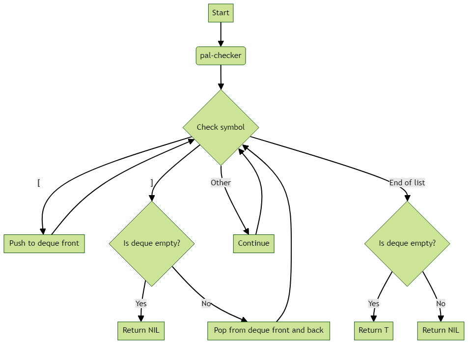
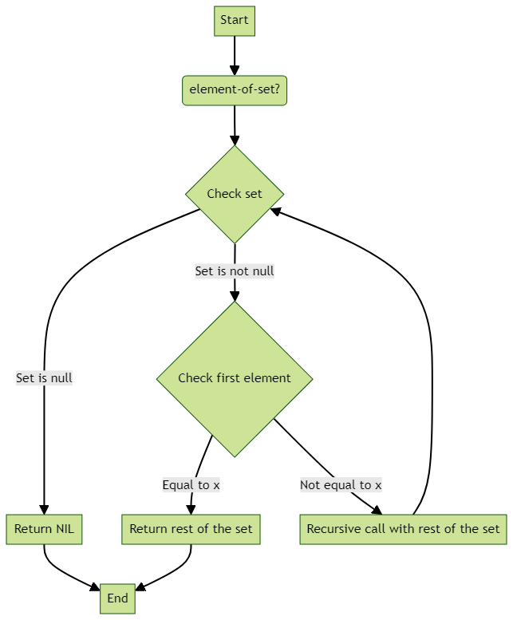
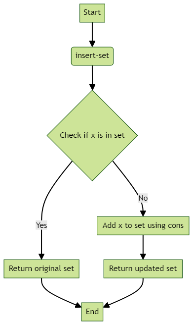
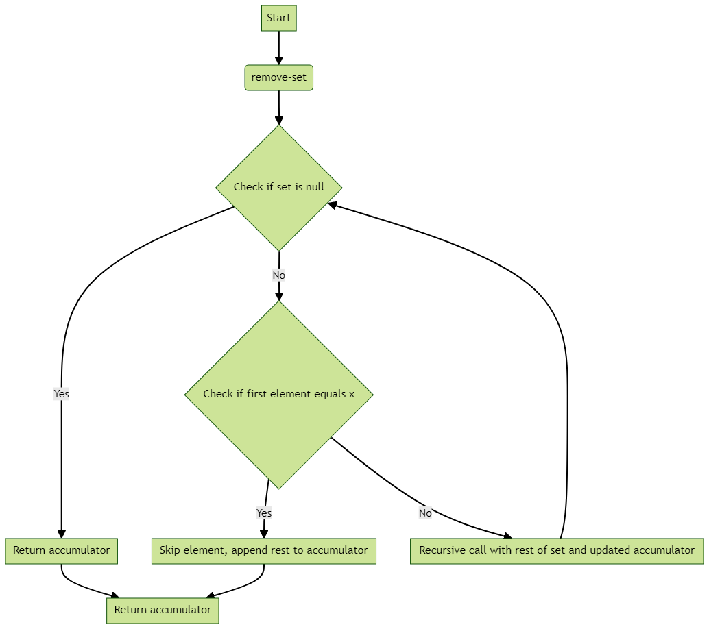
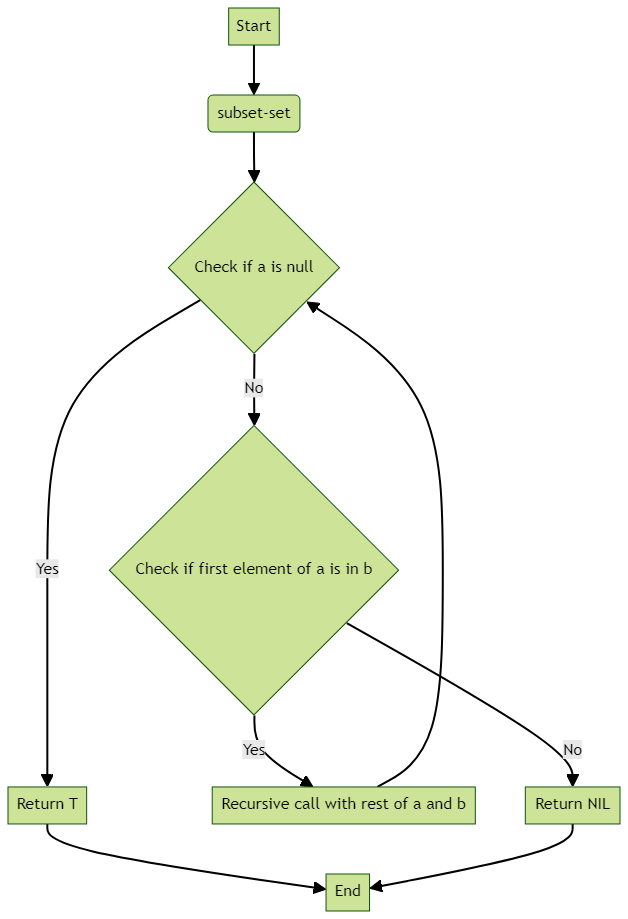
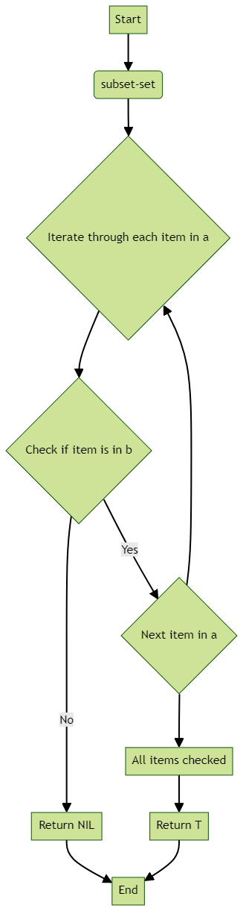

Let's break down the concepts of Deque (Double-Ended Queue) and Sets, explain their operations, and provide examples.

### Deque (Double-Ended Queue)

- A Deque is a data structure that combines the features of both a stack and a queue.
- You can add and remove elements from both the front and the back.
- It can be used in two ways: FIFO (like a queue) and LIFO (like a stack).

#### Example:
   - Think of it like a deck of cards. You can add or remove cards from the top (front) or the bottom (back) of the deck.

#### Operations:
   - PUSH-FRONT: Add an item to the front.
   - PUSH-BACK: Add an item to the back.
   - POP-FRONT: Remove and return an item from the front.
   - POP-BACK: Remove and return an item from the back.

#### Application Example:
   - Job-stealing algorithms: In parallel computing, where one worker is processing items from the front, while idle workers can steal items from the back based on priority.

#### Implementing a Deque Using Two Stacks (Example):

**Deque Operation** | **Front Stack** | **Back Stack** | **Deque Abstraction**
--- | --- | --- | ---
() | () | | 
push-front 1 | (1) | () | 1
push-front 2 | (2 1) | () | 2, 1
push-back 3 | (2 1) | (3) | 2, 1, 3
push-back 4 | (2 1) | (4 3) | 2, 1, 3, 4
push-back 5 | (2 1) | (5 4 3) | 2, 1, 3, 4, 5
pop-front | (1) | (5 4 3) | 1, 3, 4, 5
pop-front | () | (5 4 3) | 3, 4, 5
pop-back | (4 5) | () | 4, 5

### Palindrome Checker (Example):

- You can use a Deque to check if a sequence, like a string or list, is a palindrome (reads the same forwards and backwards).

```lisp
;; Define a new structure type called deque using the defstruct macro
(defstruct deque
    front ; the front stack
    back) ; the back stack

(defun pal-checker (list)
    "Check if the list list is a palindrome using a deque."

    ;; Create a new deque d with the front stack initialized to list using the make-deque function
    (do* ((d (make-deque :front list))
                (first (pop-front d) (pop-front d))
                (last (pop-back d) (pop-back d)))

             ;; Loop until the first and last elements of the deque are not equal to [ and ]
             ((not (and (equal first '[) (equal last '])))
                (and (null first) (null last))))

    ;; If the first and last elements of the deque are equal to [ and ], return T
    ;; Otherwise, return NIL
    )

```

- Explanation:
   - `(pal-checker '([ [ ] ]))` returns `T` because it's a palindrome.
   - `(pal-checker '([ [ ] ] ]))` returns `NIL` because it's not a palindrome.
   - The pal-checker function takes a list list as an argument and checks if the list list is a palindrome using a deque.
   - function first defines a new structure type called deque using the defstruct macro. The deque structure has two slots: front and back.
   -  function then creates a new deque d with the front stack initialized to list using the make-deque function. The do* loop iterates over the elements of the deque d by popping the first and last elements of the deque using the pop-front and pop-back functions, respectively. The loop continues until the first and last elements of the deque are not equal to [ and ]. If the first and last elements of the deque are equal to [ and ], the function returns T. Otherwise, the function returns NIL.
   -  Note that the function does not modify the deque d in any way, so the deque remains intact after the function returns.



### Sets

- A set is an unordered collection of unique items.
- Each item appears only once in the set.
- Sets are used to track items you have already seen and processed or to perform operations involving groups of elements.

#### Set Interface:

- **ELEMENT-OF-SET?**: Checks if an item is in the set.
- **INSERT-SET/REMOVE-SET**: Adds/removes an item from the set.
- **SUBSET-SET**: Checks if a set is a subset of another set.
- **UNION, INTERSECTION, DIFFERENCE, etc.**: Set operations for combining, finding intersections, or differences between sets.

#### Example: ELEMENT-OF-SET?

```lisp
(defun element-of-set? (x set)
 "Returns the rest of the set if x is in set; otherwise returns nil"

 ;; Check if the set is null using the when function
 (when set

     ;; If the set is not null, check if the first element of the set is equal to x using the equal function
     (if (equal x (car set))

             ;; If the first element of the set is equal to x, return the rest of the set using the cdr function
             (cdr set)

             ;; If the first element of the set is not equal to x, recursively call the element-of-set? function with the rest of the set using the cdr function
             (element-of-set? x (cdr set)))))
```

- Example:
   - `(element-of-set? 2 ())` returns `NIL` because 2 is not in an empty set.
   - `(element-of-set? 4 '(3 4 2 6))` returns `(2 6)` because 4 is found.
   - `(element-of-set? 2 '(3 4 21 6))` returns `NIL` because 2 is not found.
   - `element-of-set?` function takes an element x and a set set as arguments, and returns the rest of the set if x is in set; otherwise returns nil.
   - function first checks if the set set is null using the when function. If the set set is not null, it checks if the first element of the set is equal to x using the equal function. If the first element of the set is equal to x, the function returns the rest of the set using the cdr function. If the first element of the set is not equal to x, the function recursively calls the element-of-set? function with the rest of the set using the cdr function.


#### Run Time of ELEMENT-OF-SET?

- It may have to scan the entire set in the worst case when the object is not in the set.
- If the set has "n" elements, `ELEMENT-OF-SET?` might take up to "n" steps.
- Hence, the order of growth of the run time is O(n).

#### Lisp's MEMBER Function

- Lisp has a built-in function `MEMBER` that works similarly to `ELEMENT-OF-SET?` and checks if an element is a member of a list.

# Insert-Set (Solution)

The `insert-set` function inserts an element into a set, but only if it's not already in the set.

```lisp
(defun insert-set (x set)
    "Insert the element x into the set set if it is not already present."

    ;; Check if the element x is already in the set set using the element-of-set? function
    (if (element-of-set? x set)

            ;; If the element x is already in the set set, return the set set
            set

            ;; If the element x is not in the set set, add it to the front of the set set using the cons function
            (cons x set)))
```

- It checks if `x` is already in the set using the `element-of-set?` function.
- If `x` is in the set, it returns the original set.
- If not, it adds `x` to the set using `cons`.
- `insert-set` function takes an element x and a set set as arguments, and inserts the element x into the set set if it is not already present. The function first checks if the element x is already in the set set using the element-of-set? function. If the element x is already in the set set, the function returns the set set. If the element x is not in the set set, the function adds it to the front of the set set using the cons function, and returns the resulting set.



### Remove-Set (Solution)

The `remove-set` function removes an element from a set.

```lisp
(defun remove-set (x set &optional (acc ()))
    "Remove the element x from the set set."

    ;; Check if the set set is null
    (cond ((null set) acc)

                ;; Check if the first element of the set set is equal to x using the equal function
                ((equal x (car set))

                 ;; If yes, remove the first element of the set set using the cdr function and append it to the accumulator acc using the append function
                 (append acc (cdr set)))

                ;; If no, recursively call the function with the rest of the set set and the cons of the first element and the accumulator acc using the cons function
                (t (remove-set x (cdr set) (cons (car set) acc)))))
```

- It checks if `x` is equal to the first element of the set.
- If they are equal, it skips that element and appends the rest of the set to the accumulator.
- If they are not equal, it continues removing by recursively calling `remove-set` with the rest of the set and the updated accumulator.
- `remove-set` function takes an element x and a set set as arguments, and removes the element x from the set set. The function also takes an optional accumulator acc that is used to store the elements of the set that are not equal to x.
- The function first checks if the set set is null using the null function. If yes, it returns the accumulator acc. If no, it checks if the first element of the set set is equal to x using the equal function. If yes, it removes the first element of the set set using the cdr function and appends it to the accumulator acc using the append function. If no, it recursively calls the function with the rest of the set set and the cons of the first element and the accumulator acc using the cons function. Finally, the function returns the accumulator acc that contains the elements of the set that are not equal to x.



### Subset-Set (Solution)

The `subset-set` function checks if set `a` is a subset of set `b`.

```lisp
(defun subset-set (a b)
    "Return T if the set a is a subset of the set b."

    ;; Check if the set a is null using the null function
    (if (null a)

            ;; If the set a is null, return T
            T

            ;; If the set a is not null, check if the first element of the set a is in the set b using the element-of-set? function
            (and (element-of-set? (car a) b)

                     ;; If the first element of the set a is in the set b, recursively call the subset-set function with the rest of the set a and the set b
                     (subset-set (cdr a) b))))
```

- It checks if every element of set `a` is also an element of set `b`.
- If `a` is an empty set (null), it is a subset of any set, so it returns `T`.
- Otherwise, it checks if the first element of `a` is in `b` and recursively checks the rest of the elements in `a`.
- subset-set function takes two sets a and b as arguments, and returns T if the set a is a subset of the set b.
- The function first checks if the set a is null using the null function. If yes, it returns T because an empty set is always a subset of any set. If no, it checks if the first element of the set a is in the set b using the element-of-set? function. If yes, it recursively calls the subset-set function with the rest of the set a and the set b. If no, it returns NIL because the first element of the set a is not in the set b, and therefore the set a is not a subset of the set b.



### Iterative Implementation of Subset-Set (Solution)

Here's an iterative version of `subset-set` using `dolist`:

```lisp
(defun subset-set (a b)
    "Return T if the set a is a subset of the set b."

    ;; Iterate over the elements of the set a using the dolist function
    (dolist (item a t)

        ;; Check if the element item is in the set b using the element-of-set? function
        (unless (element-of-set? item b)

            ;; If the element item is not in the set b, return NIL using the return-from function
            (return-from subset-set nil))))

    ;; If all elements of the set a are in the set b, return T
    T)
```

- It iterates through each item in set `a` using `dolist`.
- If it finds an item in `a` that is not in `b`, it immediately returns `nil`.
- If it iterates through all items in `a` without finding a mismatch, it returns `t`, indicating that `a` is a subset of `b`.
- subset-set function takes two sets a and b as arguments, and returns T if the set a is a subset of the set b.
- function first iterates over the elements of the set a using the dolist function. In each iteration, it checks if the element item is in the set b using the element-of-set? function. If the element item is not in the set b, the function returns NIL using the return-from function, which breaks from the loop and returns a value from the function. If all elements of the set a are in the set b, the function returns T.
- Note that the dolist function returns T by default, so the t argument in the dolist form is not strictly necessary.

